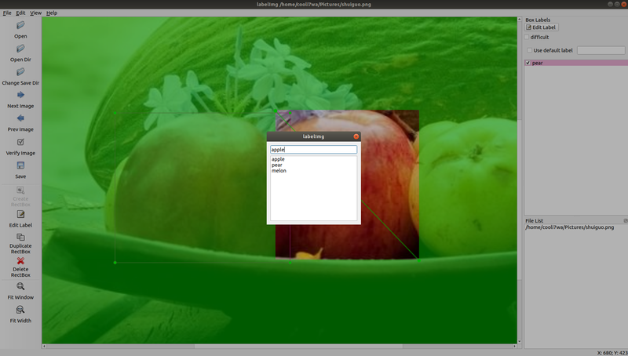
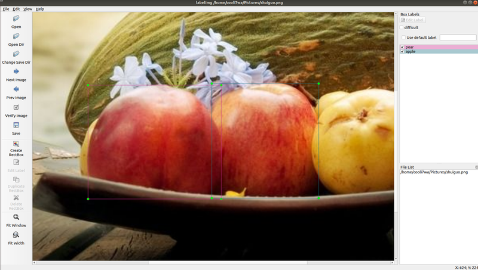

# LabelImg

LabelImg 是一款图像标注工具。

使用 Python + Qt 实现，标注的输出格式为 ImageNet 所使用的 PASCAL VOC 格式。

工具并支持多平台（linux windows macOS）。  

1. [Demo](#Demo)
2. [如何使用](#如何使用)
    - [基础操作](#基础操作)
    - [切换输出格式](#切换输出格式)
    - [快捷键](#快捷键)
3. [安装](#安装)
    - [linux下安装](#linux下安装)
    - [windows下安装](#windows下安装)
    - [macOS下安装](#macOS下安装)
4. [License](#License)

## Demo




观看 [Demo](https://v.youku.com/v_show/id_XMzc1MjA2MDQxNg==.html?spm=a2hzp.8253869.0.0)

## 如何使用

### 基础操作

- 修改 data/predefined_classes.txt 来预设分类
- 点击 Open 或 Open Dir 来打开图片或者某个包含图片的目录
- 使用鼠标滚轮来缩放图片
- 使用鼠标右键拖拽图片
- 点击 Create RectBox，在图片上点击两次鼠标左键确定标记框（移动鼠标时不必一直按左键）
- 点击分类名称，为标记分类
- 点击 Save，保存标记框和分类信息到 xml
- 点击 Next Image，打开下一张图片

### 切换输出格式

在菜单 File 下点击 PascalVOC 或 YOLO 来切换 xml 输出格式

### 快捷键

| 快捷键 | 用途 |
|------------|------------|
| Ctrl + o   | 打开单个图片 |
| Ctrl + u   | 打开图片目录 |
| Ctrl + s   | 保存标记框和分类到 xml 文件 |
| Ctrl + d   | 复制当前的标记框和标签 |
| Ctrl + e   | 编辑当前标记框分类 |
| Space      | 标记当前图片为已检验 |
| w          | 创建矩形标记框 |
| d          | 下一张图片 |
| a          | 前一张图片 |
| del        | 删除当前的标记框 |
| 滚轮上 或 Ctrl++ | 放大图片 |
| 滚路下 或 Ctrl-- | 缩小图片 |
| ↑→↓←       | 移动当前的标记框 |

## 安装

### linux下安装

- Python 2 + Qt4
```bash
sudo apt-get install pyqt4-dev-tools
sudo pip install lxml
make qt4py2
python labelImg.py
python labelImg.py [IMAGE_PATH] [PRE-DEFINED CLASS FILE]
```
- Python 3 + Qt5
```bash
sudo apt-get install pyqt5-dev-tools
sudo pip3 install lxml
make qt5py3
python3 labelImg.py
python3 labelImg.py [IMAGE_PATH] [PRE-DEFINED CLASS FILE]
```

### windows下安装

安装 [PyQt4](https://www.riverbankcomputing.com/software/pyqt/download)

安装 [lxml](http://lxml.de/installation.html)

cmd 终端中进入 labelImg 目录，并输入
```bash
    pyrcc4 -o resources.py resources.qrc
    python labelImg.py
    python labelImg.py [IMAGE_PATH] [PRE-DEFINED CLASS FILE]
```

### macOS下安装

- Python 2 + Qt4
```bash
brew install qt qt4
brew install libxml2
make qt4py2
python labelImg.py
python  labelImg.py [IMAGE_PATH] [PRE-DEFINED CLASS FILE]
```

- Python 3 + Qt5 (Works on macOS High Sierra)
```bash
brew install qt  # will install qt-5.x.x
brew install libxml2
make qt5py3
python labelImg.py
python  labelImg.py [IMAGE_PATH] [PRE-DEFINED CLASS FILE]
```

### License

Free software: [MIT license](https://github.com/cooli7wa/labelImg/blob/master/LICENSE)

本工具 fork 自 [Tzutalin LabelImg](https://github.com/tzutalin/labelImg)，并做了一些易用性修改。


```
修改点：
- 鼠标滚轮可以直接缩放图像了
- 標記框从拖拽变为两次點擊，爲了方便標記同時放大縮小圖像。
- 在放大的情況下，鼠标右键可以拖拽图像了
- 更改 EDIT 窗口的快捷键爲 ctrl + E，并在左侧工具栏显示
- 標記框的線寬改爲最小的 1 像素
- 標記框的陰影樣式，改爲內部無陰影，外部陰影，方便標記
- 標記完成後的選擇類別的框，改爲單次點擊即可，同時保留了新增分類的功能
- 按 w 開啓標記模式後，可以直接按 esc 取消了

TODO：
- 鼠标滚轮，精确缩放图像
- 右鍵，精確移動圖像
- ctrl + z， 回退改修
- ...
```